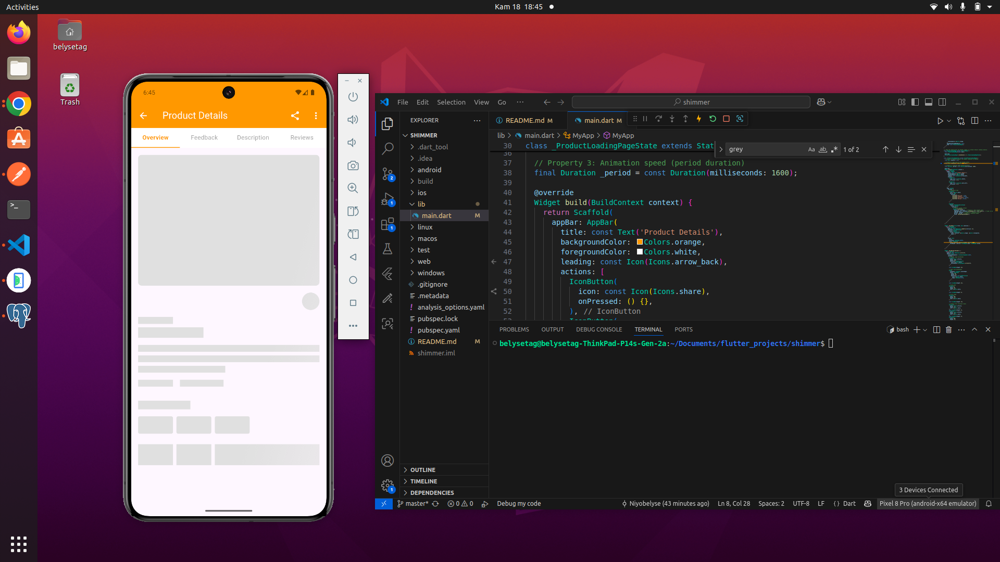

# Shimmer Product Details Loading Demo

This Flutter app demonstrates a modern shimmer loading effect for a product details page, similar to what you see in popular e-commerce apps. The shimmer effect provides a visually appealing placeholder while real content is loading.

## Features

- **Shimmer Loading Animation:** Uses the [`shimmer`](https://pub.dev/packages/shimmer) package to animate placeholders for product images, titles, prices, ratings, and action buttons.
- **Product Details Skeleton:** Mimics a real product details page layout with placeholders for all major UI elements.
- **Customizable Shimmer:** Easily adjust shimmer color, speed, and enable/disable animation.
- **Responsive Layout:** Works on mobile, desktop, and web.

## Getting Started

### How to Run

1. Make sure you have [Flutter installed](https://docs.flutter.dev/get-started/install).
2. Clone this repository:
   ```sh
   git clone https://github.com/yourusername/shimmer.git
   cd shimmer
   ```
3. Get dependencies:
   ```sh
   flutter pub get
   ```
4. Run the app:
   ```sh
   flutter run
   ```

## Attribution

Some code and structure are based on the following sources:

- [Flutter cookbook: Shimmer loading effect](https://docs.flutter.dev/cookbook/effects/shimmer-loading)
- [GeeksforGeeks: Flutter Shimmer](https://www.geeksforgeeks.org/flutter-shimmer/)

## Screenshot


